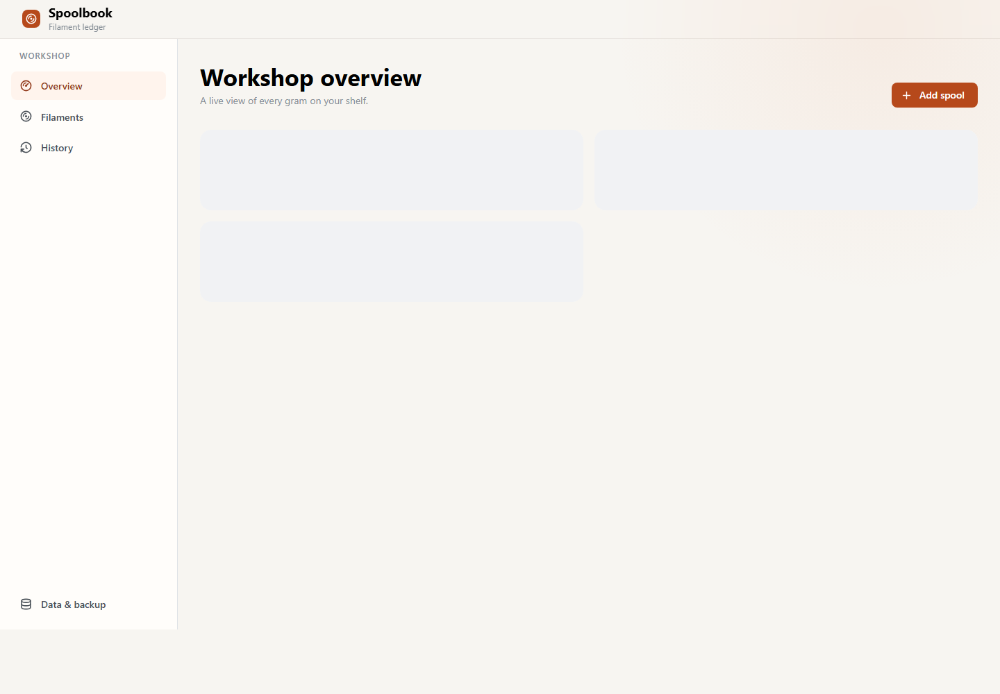
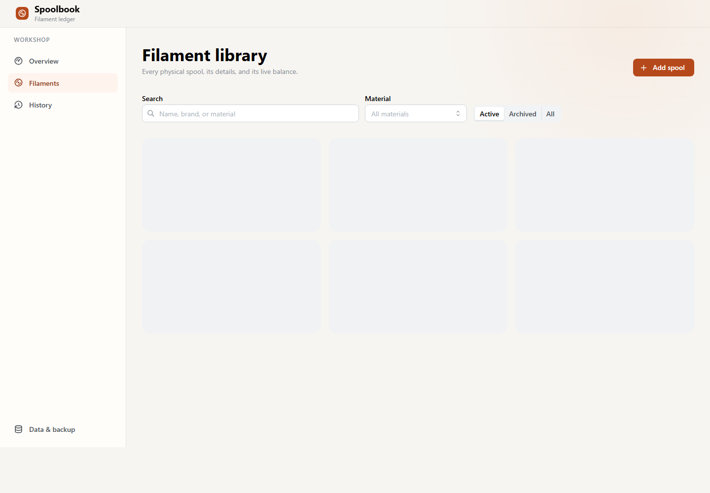
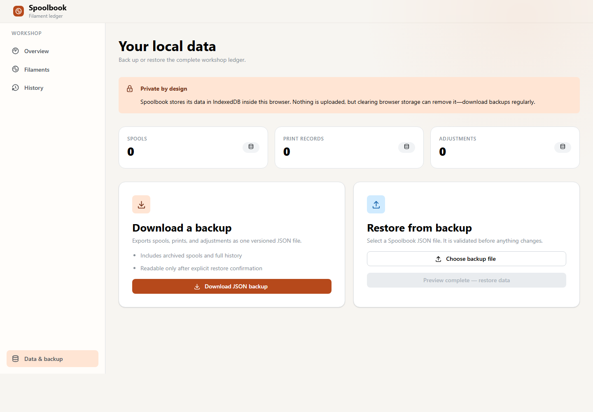

# Spoolbook

Keep an accurate, private record of the filament on your shelf. Spoolbook is a browser-based inventory tracker for 3D-printing enthusiasts and workshops.

[Open Spoolbook](https://3d-printer-filament-ms.vercel.app/)



## What you can do

- Add and organise every physical spool by material, colour, brand, and starting weight.
- Record print usage by quantity and grams per item.
- Correct a balance with a measured-weight adjustment while keeping the full history.
- Search, filter, archive, and revisit your filament library.
- Export a JSON backup and restore it when needed.
- Keep your data private: it stays in your current browser, with no account required.

## Use it in three steps

1. **Add a spool** with its starting weight.
2. **Log each print** with its quantity and material used per item.
3. **Check the live balance** before starting your next project.



## Your data, on your device

Spoolbook saves its data in your browser. Download regular backups from **Data & backup** if you want to move to another browser or safeguard your records.



## Run it yourself

```bash
pnpm install
pnpm dev
```

## License

[MIT](LICENSE)
